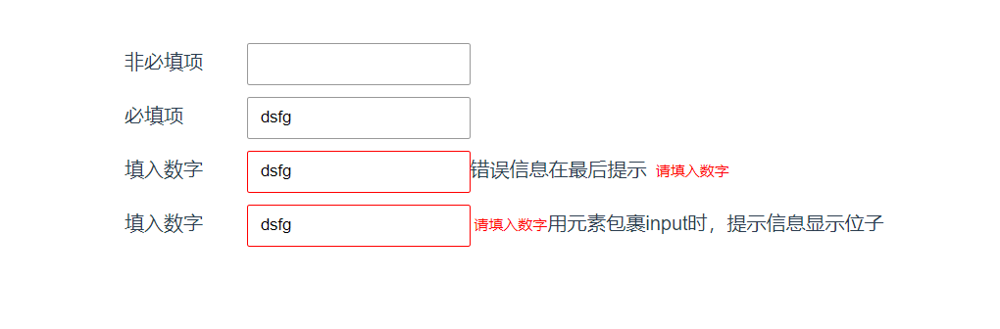

### 安装
  `
    npm install mmj-vue-vd
  `

---

### 使用

1. 在vue脚手架的main.js里引入

    `  
      import vd from 'mmj-vue-vd
    `

    `
      Vue.use(vd) 
    `
2. 在vue文件中使用
   + data里 submitOk: [] ->同组input绑定同意数组
   + 写入指令
      `<input type="text" v-vd="{rule:['numberInterval(1, 100)', 'required'],bind:'submitOk'}"  v-model="msg">`
   + 进行校验  var result = this.submitOk.$check()  返回值true/false  成功/失败
   + 清除提示信息 el.clear()  el指当前元素，可用ref获取
3. 参数 
   + rule: 校验规则数组
   + bind: 绑定的数组元素
   + nothing: 是否为非必填项
4. 样式修改
   + 输入框样式修改：通过暴露出来的className-> error_input修改，修改border需!important
   + 错误提示样式修改： 通过暴露出来的className-> error_msg修改，修改字体大小、颜色、偏移需!important

---

### 校验规则

  required: '不为空',</br>
  number: '请填入数字',</br>
  znumber: '请输入正数',</br>
  fnumber: '请输入负数',</br>
  notznumber: '请输入非正数',</br>
  notfnumber: '请输入非负数',</br>
  integer: '请输入整数',</br>
  pInteger: '请输入正整数',</br>
  nInteger: '请输入负整数',</br>
  notpInteger: '请输入非正整数',</br>
  notnInteger: '请输入非负整数',</br>

  chinese: '请输入中文',</br>
  email: '请输入邮箱地址',</br>
  url: '请输入链接地址',</br>
  postCode: '请输入邮编地址',</br>
  idCard: '请输入身份证号',</br>

  numberInterval: '两个数之间'</br>
  
---

### 注意
  1. 使用v-for遍历input时，不可使用index作为key值，需使用唯一值作为key值
  2. 尽量同一提交表单绑定同一个数组对象
  3. 必填优先级高于非必填，即require > nothing
  4. $check() 可传一个布尔值做参数，true验证所有，false知道有一个验证失败就停止，默认false

---

### 使用实例
1. html
```
    <div class="input_group">
     <label>非必填项</label>
     <input class="input" type="text" value="" v-vd="{rule:['number'],bind:'submitOk', nothing: 'nothing'}">
    </div>
    <div class="input_group">
      <label>必填项</label>
      <input class="input" type="text" value="dsfg" v-vd="{rule:['required'],bind:'submitOk'}">
    </div>
    <div class="input_group">
      <label>填入数字</label>
      <input class="input" type="text" value="dsfg" v-vd="{rule:['required', 'number'],bind:'submitOk'}">错误信息在最后提示
    </div>
    <div class="input_group">
      <label>填入数字</label>
      <span>
        <input class="input" type="text" v-model="dsfg" v-vd="{rule:['required', 'number'],bind:'submitOk'}">
      </span>用元素包裹input时，提示信息显示位子
    </div>
```
2. js
  ```
  data () {
    return {
      msg: '3221',
      submitOk: []
    }
  }
  ```


